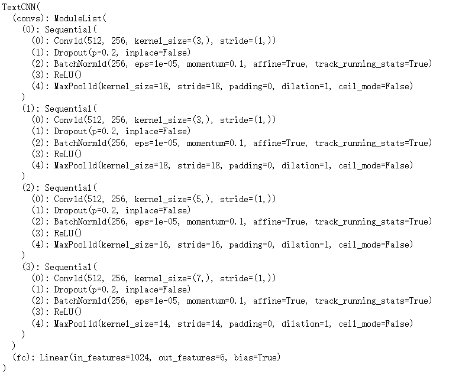

# 情感六分类
> pytorch 1.12.1    
> xlrd 2.0.1     
> openpyxl         
# 数据集
1. 数据集：[情感分类数据集](https://www.biendata.xyz/ccf_tcci2018/datasets/emotion/)
          [情感对话生成数据集](https://www.biendata.xyz/ccf_tcci2018/datasets/ecg/)
2. **情感分类数据集**：其他（Null), 喜好(Like)，悲伤(Sad)，厌恶(Disgust)，愤怒(Anger)，高兴（Happiness）六类，依次标号为0到5。
             NLPCC Emotion Classification Challenge（训练数据中17113条，测试数据中2242条）和微博数据筛选后人工标注(训练数据中23000条，测试数据中2500条)  
   **情感对话生成数据集**:其他（Null)，喜好(Like)，悲伤(Sad)，厌恶(Disgust)，愤怒(Anger)，高兴（Happiness）六类
# 数据预处理
1. **情感分类数据集**：替换英文符号，删除表情(eg: [流泪])，分类（已分词）

2. **情感对话生成数据集**：

   ECG-train：列表中每一个元素都是列表，为一个问答对。删除空格，替换英文符号，分类（已分词）

   ECG-test：分词，替换英文符号，分类
   
   > 选择`score = 2`的数据
   
3. 数据清洗:删除重复的符号、去重

   |  Emotion  |   Size |      |
   | :-------: | :----: | :--: |
   |   Null    | 523548 | 0.241 |
   |   Like    | 442140 | 0.204 |
   |    Sad    | 302263 | 0.139 |
   |  Disgust  | 381033 | 0.176 |
   |   Anger   | 216533 | 0.1 |
   | Happiness | 303254 | 0.14 |
   | **Total** |     2168771     |      |

# 模型

1. TextCNN

   
   
2. Transformer（Encoder）

   ```python
   class TransformerClassifier(nn.Module):
       def __init__(self):
           super(TransformerClassifier, self).__init__()
           self.encoder = Encoder()    # [batch, source_len, d_model]
           self.fc = nn.Linear(max_len * d_model, output_size)
   
       def forward(self, inputs):
           """
           inputs: [batch, source_len]
           """
           outputs, attns = self.encoder(inputs)   # [batch, source_len, d_model]
           outputs = self.fc(outputs.view(outputs.shape[0], -1)) # [batch, output_size]
   
           return outputs, attns
   ```

   


# 代码

代码中遇到的一些问题及解决办法

- https://cache.one/read/16905246
- https://www.kaggle.com/general/197993
- https://blog.csdn.net/weixin_42943494/article/details/108127523
- https://blog.csdn.net/cyz52/article/details/90454158
- https://blog.csdn.net/lcy6239/article/details/115786432
- https://blog.csdn.net/qsx123432/article/details/120583529

参考：
- [如何选择优化器 optimizer](https://blog.csdn.net/aliceyangxi1987/article/details/73210204)
- [【深度学习之美】激活引入非线性，池化预防过拟合（入门系列之十二）](https://developer.aliyun.com/article/167391)
- [Keras文本分类实战（上）](https://developer.aliyun.com/article/657736)
- [Keras文本分类实战（下）](https://developer.aliyun.com/article/663186?spm=a2c6h.24874632.expert-profile.204.5b4aadc9oATARD)
- [text_classification](https://github.com/LuffysMan/text_classification)
- [基于BiLSTM的对话文本情感分析](http://www.chenjianqu.com/show-38.html)
- [keras中神经网络优化](https://blog.csdn.net/Xwei1226/article/details/81297500)
- [LSTM中文文本进行情感多分类](https://github.com/DLLXW/MultiClassify_LSTM_ForChinese)
- [基于LSTM三分类的文本情感分析](https://github.com/Edward1Chou/SentimentAnalysis)
