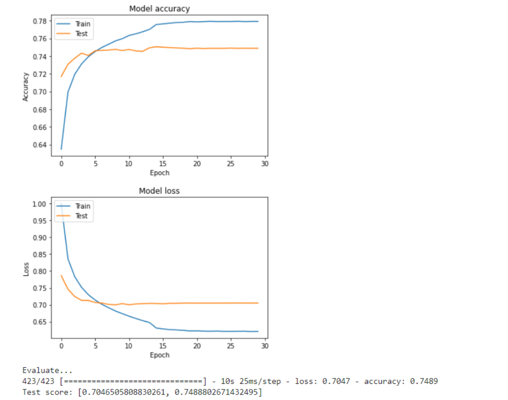
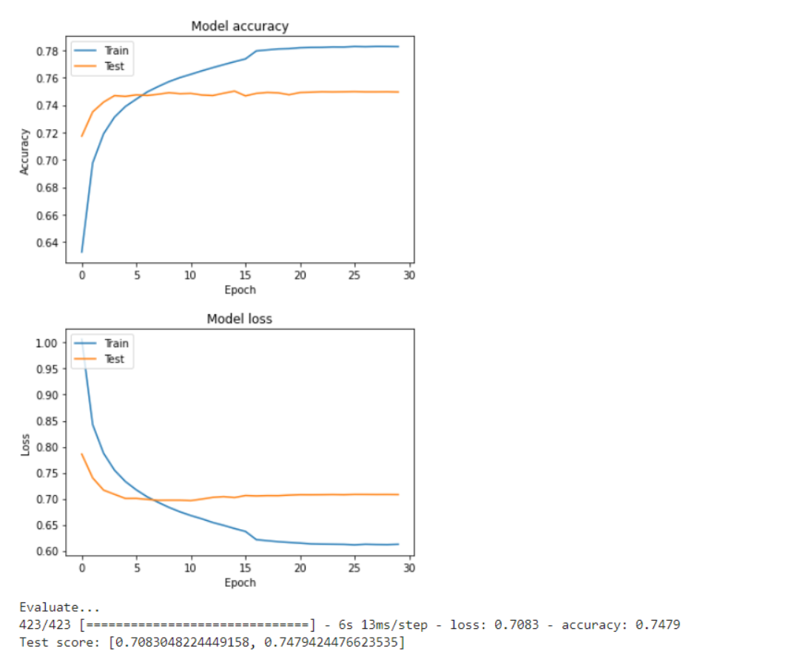
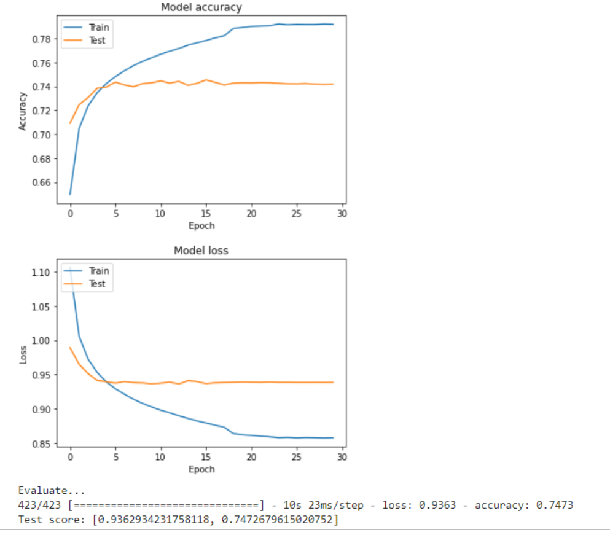

# 情感六分类

# 数据集
1. 数据集：[情感分类数据集](https://www.biendata.xyz/ccf_tcci2018/datasets/emotion/)
          [情感对话生成数据集](https://www.biendata.xyz/ccf_tcci2018/datasets/ecg/)
2. **情感分类数据集**：其他（Null), 喜好(Like)，悲伤(Sad)，厌恶(Disgust)，愤怒(Anger)，高兴（Happiness）六类，依次标号为0到5。
             NLPCC Emotion Classification Challenge（训练数据中17113条，测试数据中2242条）和微博数据筛选后人工标注(训练数据中23000条，测试数据中2500条)
   **情感对话生成数据集**:其他（Null)，喜好(Like)，悲伤(Sad)，厌恶(Disgust)，愤怒(Anger)，高兴（Happiness）六类
# 数据预处理
1. **情感分类数据集**：删除空格，替换英文符号，删除表情(eg: [流泪])，分类

   |  Emotion  | Size  |
   | :-------: | :---: |
   |   Null    | 13869 |
   |   Like    | 6496  |
   |    Sad    | 5285  |
   |  Disgust  | 5891  |
   |   Anger   | 3122  |
   | Happiness | 4767  |
   | **Total** | 39430 |

2. **情感对话生成数据集**：

   ECG-train：列表中每一个元素都是列表，为一个问答对。删除空格，替换英文符号，分类

   |  Emotion  |  Size   |
   | :-------: | :-----: |
   |   Null    | 537398  |
   |   Like    | 460849  |
   |    Sad    | 311269  |
   |  Disgust  | 386466  |
   |   Anger   | 220559  |
   | Happiness | 321873  |
   | **Total** | 2238414 |
   
   ECG-test

   |  Emotion  | Size |
   | :-------: | :--: |
   |   Null    |  0   |
   |   Like    | 1459 |
   |    Sad    | 1204 |
   |  Disgust  | 1412 |
   |   Anger   | 715  |
   | Happiness | 1433 |
   | **Total** | 6223 |
   
3. 数据清洗:删除重复的符号、去重

   |  Emotion  |       Siz       |      |
   | :-------: | :-------------: | :--: |
   |   Null    | 551267-->522995 | 0.24 |
   |   Like    | 468804-->440551 | 0.2  |
   |    Sad    | 317758-->301459 | 0.13 |
   |  Disgust  | 393769-->381264 | 0.17 |
   |   Anger   | 224396-->216072 | 0.09 |
   | Happiness | 328073-->302244 | 0.14 |
   | **Total** |     2164585     |      |

- 由于某些不可知原因，每次去重后数据位置发生变化，但数据量并不会发生改变(相较于未去重减少，只是去重数据位置不固定)
- ![(C:\Users\14667\AppData\Roaming\Typora\typora-user-images\image-20220413002814804.png)
- 在所有数据基础上训练30轮，训练集准确率为70%左右
- 因所有数据训练时间过长，故每个随机选取20w进行试验
# 尝试：
  1. ```
     model.add(Embedding(output_dim=vocab_dim,
                             input_dim=n_symbols,
                             mask_zero=True,
                             weights=[embedding_weights],
                             input_length=input_length))  # Adding Input Length
         model.add(LSTM(output_dim=50, activation='tanh'))
         model.add(Dropout(0.5))
         model.add(Dense(3, activation='softmax')) # Dense=>全连接层,输出维度=3
         model.add(Activation('softmax'))

​		在所有数据基础上训练30轮，训练集准确率为70%左右

 2. 根据**[ text_classification](https://github.com/LuffysMan/text_classification)**修改网络，准确率提升到0.77

 3. 

    将BN层调整至Dropout层下

    

    4.  
	   
       ```
          model.add(Embedding(output_dim=vocab_dim,
                               input_dim=n_symbols,
                               mask_zero=True,  # 
                               trainable=True,  
                               weights=[embedding_weights],
                               input_length=input_length))  # Adding Input Length
           model.add(SpatialDropout1D(0.4))  # 功能与 Dropout 相同，但它会丢弃整个 1D 的特征图而不是丢弃单个元素。
           model.add(Conv1D(activation='tanh', padding='same', filters=32, kernel_size=5))  # 卷积层
           model.add(MaxPool1D(pool_size=2))   # 池化层
           model.add(Bidirectional(LSTM(100, return_sequences=True, activation='tanh'), merge_mode='concat'))   # 双向循环神经网络层
           model.add(Dropout(0.3))
           model.add(MaxPool1D(pool_size=2))
           model.add(LSTM(50, activation='tanh'))  # LSTM 层
           model.add(Flatten())  # 扁平层
           model.add(Dropout(0.3))
           model.add(BatchNormalization()) # 批标准化
           model.add(Dense(6, activation='softmax'))            #加入偏置项
       ```
       
	   
       
	   5. ```
	      model.add(Embedding(output_dim=vocab_dim,
	                       input_dim=n_symbols,
	                       mask_zero=True,  # 
	                       trainable=True,  
	                       weights=[embedding_weights],
	                       input_length=input_length))  # Adding Input Length
	      model.add(SpatialDropout1D(0.4))  # 功能与 Dropout 相同，但它会丢弃整个 1D 的特征图而不是丢弃单个元素。
	      model.add(Conv1D(activation='tanh', padding='same', filters=32, kernel_size=5))  # 卷积层
	      model.add(MaxPool1D(pool_size=2))   # 池化层
	      model.add(Bidirectional(LSTM(100, return_sequences=True, activation='tanh'), merge_mode='concat'))   # 双向循环神经网络层
	      model.add(Dropout(0.3))
	      model.add(MaxPool1D(pool_size=2))
	      model.add(BatchNormalization()) # 批标准化
	      model.add(LSTM(50, activation='relu'))  # LSTM 层
	      model.add(Flatten())  # 扁平层
	      model.add(Dropout(0.3))
	      model.add(Dense(6, activation='softmax'))            #加入偏置项
	      ```



6. ```
   model = Sequential()
       # 使用预训练的词向量 trainable=True 表示可训练
       model.add(Embedding(output_dim=vocab_dim,
                           input_dim=n_symbols,
                           mask_zero=True, 
                           trainable=True,  
                           weights=[embedding_weights],
                           input_length=input_length))  # Adding Input Length
       model.add(SpatialDropout1D(0.3))  # 功能与 Dropout 相同，但它会丢弃整个 1D 的特征图而不是丢弃单个元素。
       model.add(Conv1D(activation='tanh', padding='same', filters=32, kernel_size=7))  # 卷积层
       model.add(MaxPool1D(pool_size=2))   # 池化层
       model.add(Bidirectional(LSTM(100, return_sequences=True, activation='tanh'), merge_mode='concat'))   # 双向循环神经网络层
       model.add(Dropout(0.2))
       model.add(MaxPool1D(pool_size=2))
       model.add(LSTM(50, activation='tanh'))  # LSTM 层
       model.add(Flatten())  # 扁平层
       model.add(Dropout(0.2))
       model.add(BatchNormalization()) # 批标准化
       model.add(Dense(6, activation='tanh'))            #加入偏置项
       # model.add(Dense(3, activation='tanh',            #加入偏置项
       #                 kernel_regularizer=regularizers.l2(0.01),
       #                 activity_regularizer=regularizers.l2(0.01)))
       model.add(Activation('softmax'))
   ```

   


# 代码

代码中遇到的一些问题及解决办法

- https://cache.one/read/16905246
- https://www.kaggle.com/general/197993
- https://blog.csdn.net/weixin_42943494/article/details/108127523
- https://blog.csdn.net/cyz52/article/details/90454158
- https://blog.csdn.net/lcy6239/article/details/115786432
- https://blog.csdn.net/qsx123432/article/details/120583529

参考：
- [如何选择优化器 optimizer](https://blog.csdn.net/aliceyangxi1987/article/details/73210204)
- [【深度学习之美】激活引入非线性，池化预防过拟合（入门系列之十二）](https://developer.aliyun.com/article/167391)
- [Keras文本分类实战（上）](https://developer.aliyun.com/article/657736)
- [Keras文本分类实战（下）](https://developer.aliyun.com/article/663186?spm=a2c6h.24874632.expert-profile.204.5b4aadc9oATARD)
- [text_classification](https://github.com/LuffysMan/text_classification)
- [基于BiLSTM的对话文本情感分析](http://www.chenjianqu.com/show-38.html)
- [keras中神经网络优化](https://blog.csdn.net/Xwei1226/article/details/81297500)
- [LSTM中文文本进行情感多分类](https://github.com/DLLXW/MultiClassify_LSTM_ForChinese)
- [基于LSTM三分类的文本情感分析](https://github.com/Edward1Chou/SentimentAnalysis)
